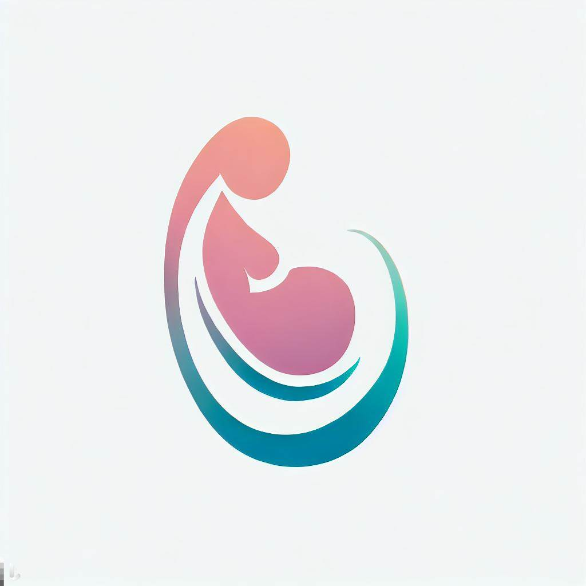

# PregChat: Your Personal Pregnancy Companion
<p align="center">
  
</p>

## Overview
```
GCP Credits Expired
```
[PregChat Link](https://pregchat.vercel.app)

[Youtube](https://youtu.be/9vNzMzKjVOI)

[Sample Commands](https://github.com/TechSpiritSS/PregChat_Dialogflow/blob/extension/Samples.md)

PregChat is a chatbot designed to help expecting mothers access important information about their pregnancy in a simple, accessible and interactive way. Our chatbot is powered by Dialogflow, a Google Cloud-based natural language processing platform.

With PregChat, mothers can easily ask about their symptoms and receive information regarding medical emergencies, first aid, medications, and exercises.  PregChat aims to provide support and education to mothers in need, ultimately improving the health outcomes for both mother and child.
## Features
- Voice-based interaction for easy accessibility
- Personalized responses based on individual user input
- Quick access to medical emergency information and first aid guidelines
- Information on medication safety during pregnancy
- Tips on exercises to help expecting mothers stay healthy throughout their pregnancy

## Benefits
PregChat provides the following benefits to expecting mothers all across the world:

- Access to pregnancy-related information and support.
- Ability to communicate in their native language. (Still in testing phase)
- Easy-to-use and intuitive interface.
- Available 24/7.

## Usage
PregChat is accessible through a web-based interface and can be accessed from any device with an internet connection. The chatbot is designed to provide expecting mothers with easy access to important information about their pregnancy in a simple and interactive way.

To get started, simply visit our website and say "Hi" to initiate the chat. From there, you can ask any questions related to your pregnancy, and our chatbot will provide you with personalized responses in real-time.

# Limitations
Currently, PregChat is only available in English (en-us). While the chatbot provides useful information, it should not be used as a substitute for professional medical advice. It is important to consult with a medical professional for any serious concerns or medical emergencies.

# Future Plans
In the future, 
- We plan to expand the language support of PregChat to make it accessible to more mothers around the world. (The Google Translate API is $45/hrs and our credit limit was $50 so we skipped that for now)
- We also plan to add more features to provide mothers with even more comprehensive information and support throughout their pregnancy journey.
- Integration of Google BARD for more interactive conversation.
- Use of proper database instead of Google Sheets to provide more information.

# Technologies used
- Frontend - ReactJS 
- Backend - NodeJS 
- Database - Google Sheets 
- API - Dialogflow API, SheetsDB  
- Tools - Google Cloud Platform, Vercel, GitHub  
# Conclusion
PregChat is a powerful tool for mothers looking for quick and easy access to important information about their pregnancy. Our chatbot is designed to be simple, accessible and interactive, allowing mothers to ask questions and receive personalized responses in real-time. With PregChat, we hope to make the journey of pregnancy a little easier and more enjoyable for mothers around the world.

Made with the help of my teammate [Ankit Rout](https://github.com/ankitrout2903)
